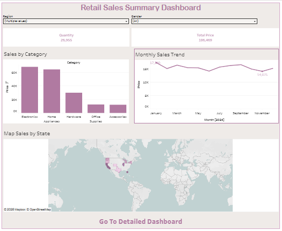
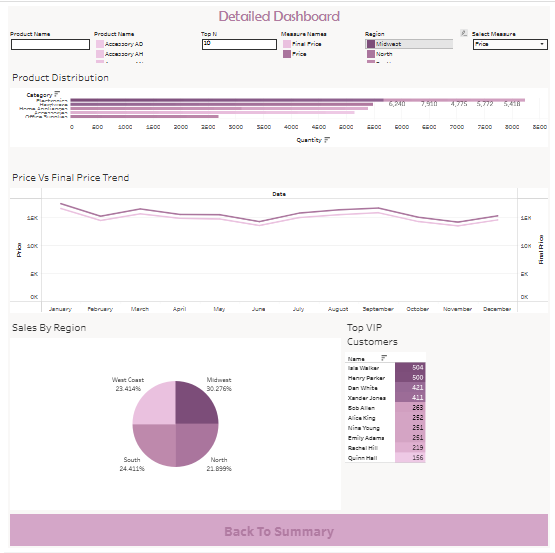

# 📊 Retail Sales Analysis & Performance Dashboard (Tableau)

> An interactive, multi-tier retail business intelligence dashboard built in Tableau. Features a high-level executive summary and an operational deep-dive dashboard connected via dashboard actions, featuring dual-axis trend analysis, Top-N customer rankings, and geographic mapping.

---

## 🖥️ Dashboard Previews

### 1. Retail Sales Summary Dashboard (Executive View)

### 2. Detailed Analytics Dashboard (Operational View)

---

## 📌 Key Metrics & Business Questions Answered

### 1. Key Performance Indicators (KPIs)
* **Total Volume Sold:** Evaluates aggregate units moved across all product categories.
* **Total Sales Revenue:** Tracks gross revenue benchmarks.
* **Price Realization & Discount Variance:** Monitors the margin spread between listed base price and realized final transaction price.
* **Top Customer Value:** Identifies high-spending loyalty segments and VIP buyer contribution.

---

### 2. Business Questions Answered

#### 📈 Executive Summary View
* **What are the top-grossing product categories?**
  * Ranks categorical performance, highlighting revenue drivers such as **Electronics** and **Home Appliances** against lower-velocity categories like Hardware and Office Supplies.
* **How does sales revenue trend month-over-month?**
  * Tracks seasonal fluctuations across the calendar year to detect peak and low purchasing cycles.
* **Which states drive the highest sales concentration?**
  * Uses a geographic filled/symbol map to pinpoint state-level sales density across national operations.

#### 🔍 Detailed Operational View
* **How does listed price compare to actual realized price over time?**
  * Implements a **Dual-Axis Line Chart** comparing `Price` vs. `Final Price` across months to visualize discount behavior and markdown impacts.
* **Who are the top-tier VIP customers?**
  * Uses parameter-driven dynamic ranking to isolate top customers by transaction volume and spend.
* **Which market territory holds the largest revenue share?**
  * Quantifies regional market split across **Midwest**, **North**, **South**, and **West Coast** regions using proportional pie analysis.
* **What is the unit volume distribution across sub-products?**
  * Evaluates item-level demand distribution to assist inventory allocation and stock planning.

---

## 🛠️ Tableau Features & Technical Implementation

* **Dual-Axis Charting:** Synchronized axes to analyze the relationship and margin gap between baseline `Price` and actual `Final Price` over time.
* **Interactive Dashboard Navigation:** Integrated navigation buttons and URL/Filter Actions allowing users to transition between the **Executive Summary** and the **Detailed Breakdown**.
* **Dynamic Top-N Filtering:** Utilized Tableau Parameters (`Top N`) to give end-users control over how many VIP customers to view simultaneously.
* **Custom Measure Selection:** Integrated dynamic measure parameters to switch metrics on the fly without cluttering the canvas.
* **Geospatial Analysis:** Interactive map mapping state-level transactions with custom color gradients matching sales volume.

---

## 📂 Repository Contents

* `workbook/`: Packaged Tableau Workbook (`.twbx`) containing all worksheets, calculated fields, and dashboard actions.
* `data/`: Raw sales transactional dataset (`.csv`).
* `assets/`: High-resolution dashboard screenshots.

---

## 🚀 How to View & Explore

1. **Interactive Cloud Version:** [Explore on Tableau Public](https://public.tableau.com/app/profile/lojaina.ayman/viz/RetailSales_17877730941800/DetailedDashboard?publish=yes) *(Recommended)*
2. **Local Inspection:** Download `Retail_Sales_Dashboard.twbx` from the `workbook/` directory and open it with **Tableau Desktop** or the free **Tableau Reader**.
